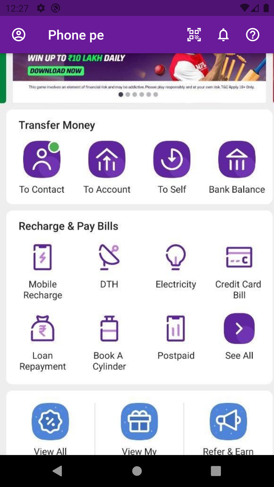
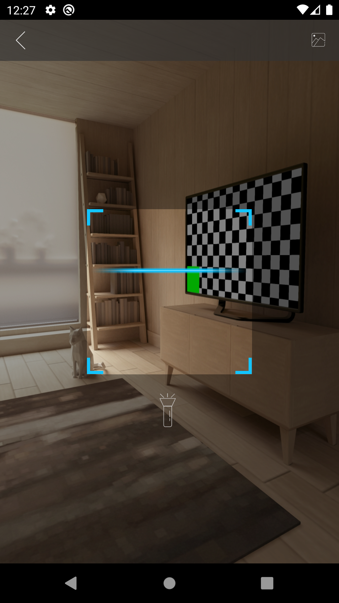
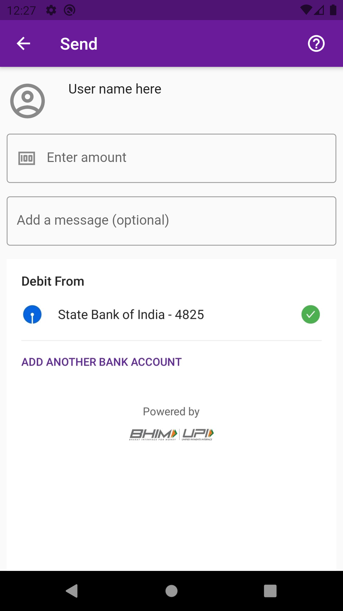
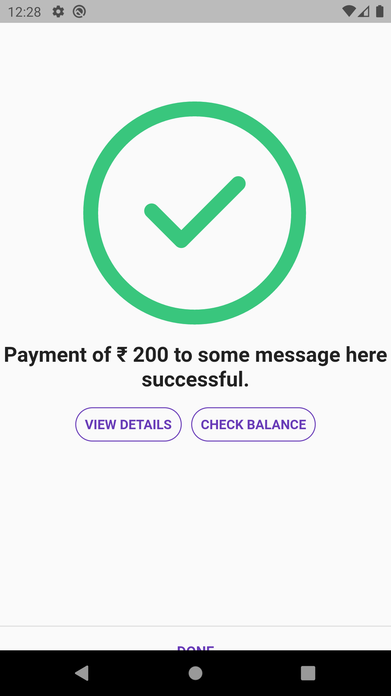

## Update
 - I've created this in September 2021 now the UI of the phone-pe app has changed and this won't look as legitimate as it used to.
 - I'll not be updating this for security purposes.

# A clone of phone-pe payment app - Clone-pe

Out of my curiosity about how these payment apps work I wanted to make my own working clone of phone pe.

It works like the normal app.

First, we need to scan any vendor's QR code.

The app extracts the account holder name and UPI ID from the QR code which is done by the string parsing algorithm which I've written.
After parsing it sends the information to the payment screen where the user can fill the necessary details.

After successful completion and the Twilio API runs and sends the message of the transaction to the extracted number.

## To install

1. Clone this repo and run pub get.
2. flutter run. 
